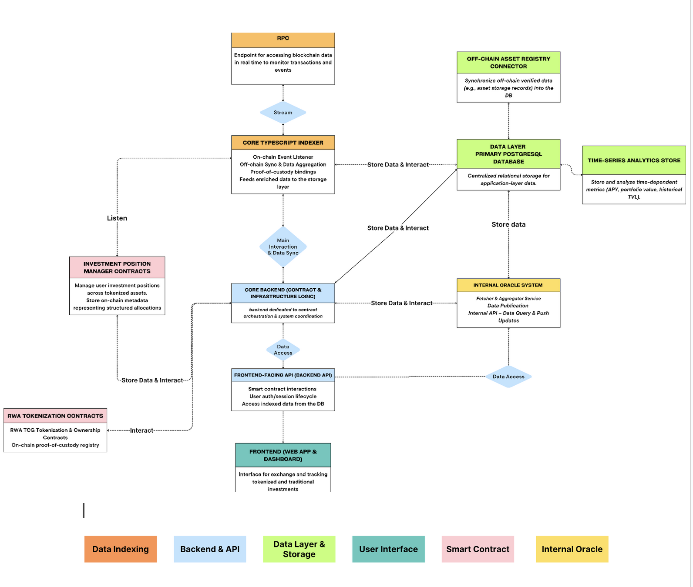

# ⚡ Thunder on Stellar – Smart Contract Foundations

This repository contains the **first version of the core smart contracts** for **Thunder** built with **Stellar's Soroban**.  
It is part of our submission for the **Stellar Community Fund (SCF)** and represents the foundation of our integration with the Stellar ecosystem.

---

image.png

## 🚀 About Thunder

**Thunder** is an **all-in-one solution** securing **private and professional investments in collectible assets**.

We enable:

- 📦 Investment, vaulting, and securitization of physical and digital collectibles
- 🔐 Proprietary logistics and storage infrastructure
- 🔁 Secure exchange and on-chain asset management for regulated and non-regulated assets

Thunder combines **real-world asset custody** with the power of **blockchain transparency and programmability**.

---

## 🧱 Repository Scope

This repository focuses **exclusively** on the **smart contract layer** of Thunder’s architecture on Stellar, using **Soroban**.

### ✅ Included Contracts

- **ERC20-style Token** – A fungible token adapted for Soroban for future prupose.
- **ERC3643-inspired Compliance Token** – With allowlist/KYC logic and transfer restrictions.
- **nvestment Vault Contract** – A profit-sharing smart contract where users deposit tokens and receive shares.
  Profits from off-chain sources can be manually injected and are distributed proportionally.
  Designed to bridge Web2 yield into Soroban smart contract logic.
- **Mock ERC721 NFT** – For early experimentation with collectible asset representations.
  Each contract includes unit tests and is organized under the `/contracts` directory.

---

## 📦 Project Structure

```text
.
├── contracts
│   ├── erc20_token
│   ├── erc3643_compliance_token
│   ├── vault
│   └── nft_mockup_erc721
├── Cargo.toml
└── README.md
```

---



#### ✅ `erc3643_compliance_token`

A prototype inspired by the **ERC-3643** standard with:

- Identity (KYC) management via allowlists.
- On-chain compliance logic with access control.
- Support for custom transfer rules.

> ✨ This contract is adapted for the Soroban environment, as there's no official ERC-3643 standard yet.

## ⚠️ Not Included (Yet)

This repository **does not** include the following components (currently in development and private):

- Backend logic (Node.js API / authentication / indexers)
- Frontend DApp interfaces
- Admin & logistics dashboards
- Advanced token bridging or L2/L0 integrations
- Real asset lifecycle management modules

---

## 🧪 Running Tests

Run all contract unit tests with:

```bash
cargo test
```

---

## 📍 Purpose of This Repo

This repository serves as:

- A technical demonstration for the **SCF (Stellar Community Fund)**
- The **contractual foundation** of Thunder’s protocol on Stellar
- A **starting point** for future open development of our infrastructure

---

## 🛠 Built with

- [Stellar Soroban](https://soroban.stellar.org/)
- [Rust](https://www.rust-lang.org/)
- [Stellar SDKs & CLI](https://developers.stellar.org/)

---

Thunder is bridging **real-world assets** and **blockchain security**, one collectible at a time ⚡
